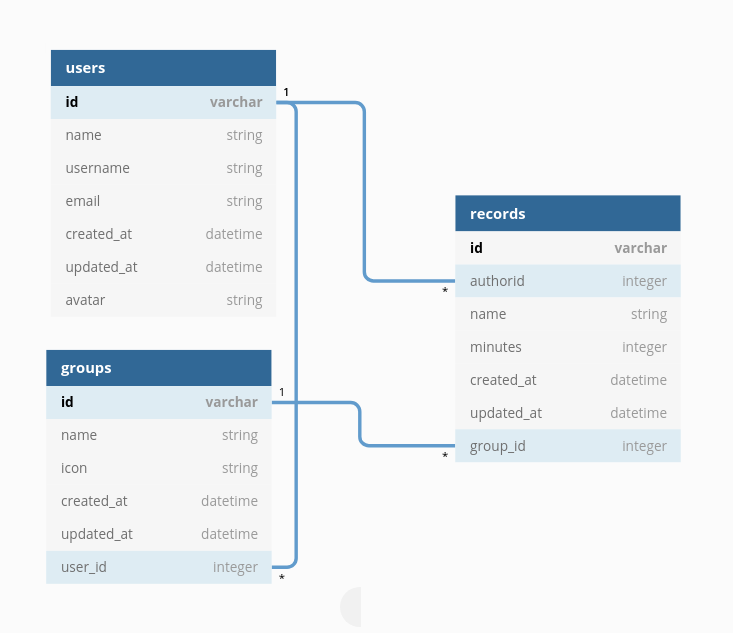
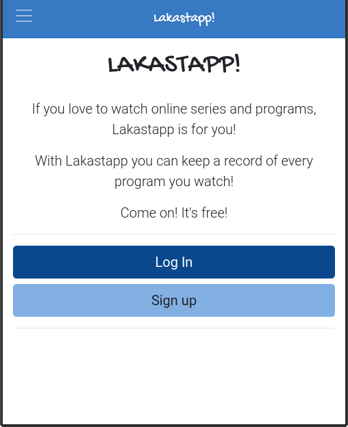
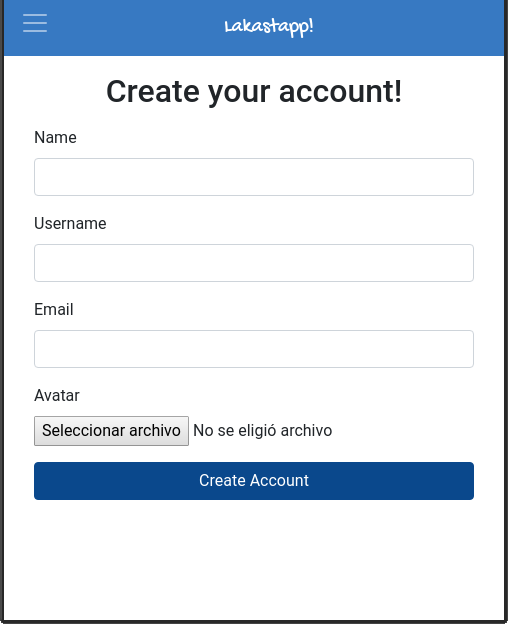
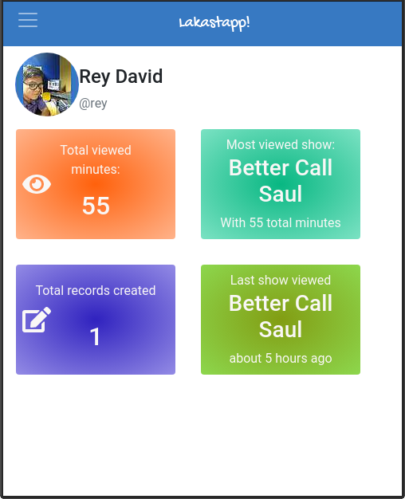
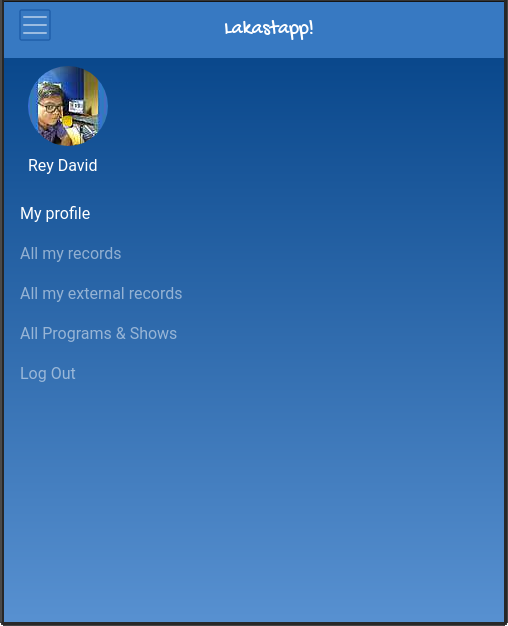
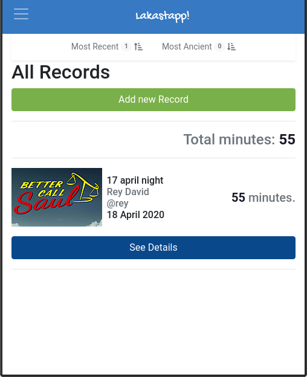
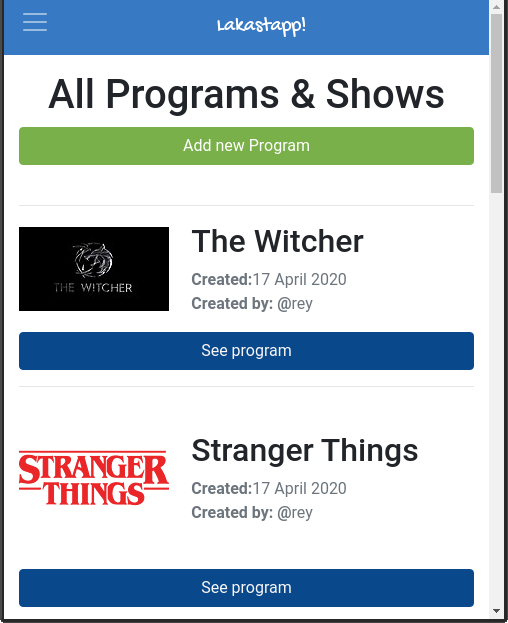
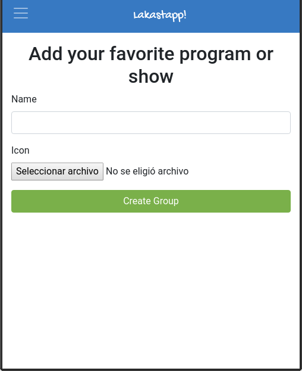

<!-- Badges -->
<p>
  
  <a href="#" target="_blank">
    
  </a>
  <a href="https://twitter.com/redacuve" target="_blank">
    
  </a>
</p>


<!-- Project Header -->
  <p align="center">
    
  <br>
  <h1 align="center">Project Lakastapp!</h1>
  <p align="center">
  <br>
   <a href="https://github.com/redacuve/lakastapp"><strong>Explore the repo »</strong></a>
  <br>
    <a href="https://github.com/redacuve/lakastapp/issues">Request Feature</a>
  </p>
  <h2 align="center"><a href="https://lakastapp.herokuapp.com/"><strong>Live Link!</strong></a></h2>

<!-- TABLE OF CONTENTS -->

## Table of Contents

* [About the Project](#about-the-project)

* [Entity Relationship Diagram](#entity-relationship-diagram)

* [Built With](#built-with)

* [Getting Started](#getting-started)

* [How it Works](#how-it-works)

* [Contributing](#contributing)

* [License](#license)

* [Contact](#contact)

<!-- ABOUT THE PROJECT -->

## About The Project

This is a mobile web app where you can keep a record of every program you watch if the program is not in the database, is so easy to add that program!.

With lakastapp you can know the time you watch every program.

Go to: <a href="https://lakastapp.herokuapp.com/" target="_blank">https://lakastapp.herokuapp.com/</a>

<p align="center">
  
</p>

## Entity Relationship Diagram

<h3 align="center">Entity Relationship Diagram</h3>
<p align="center">
  
</p>


### Built With

* [Ruby](https://ruby-doc.org/core-2.7.0/)

* [HTML5](https://developer.mozilla.org/es/docs/HTML/HTML5)

* [SASS](https://sass-lang.com/documentation)

* [POSTGRESQL](https://www.postgresql.org/docs/)

* [IBM Cloud](https://cloud.ibm.com/docs)

* Gems used:
    * [bootstrap](https://rubygems.org/gems/bootstrap)
    * [carrierwave](https://rubygems.org/gems/carrierwave)
    * [fog-aws](https://rubygems.org/gems/fog-aws)
    * [mini_magick](https://rubygems.org/gems/mini_magick)
    * [rspec-rails](https://rubygems.org/gems/rspec-rails)
    * [database_cleaner](https://rubygems.org/gems/database_cleaner)
    * [capybara](https://rubygems.org/gems/capybara)
        * See the Gemfile.lock for more information.

* Deployed with
    * [HEROKU](https://devcenter.heroku.com/categories/reference)
<!-- GETTING STARTED -->

## Getting Started

Simply go to : Go to: <a href="https://lakastapp.herokuapp.com/" target="_blank">https://lakastapp.herokuapp.com/</a>

Enjoy!.

If you want to get a local copy up and running follow these simple steps.

Clone or fork the <a href="https://github.com/redacuve/lakastapp">repo</a> [git@github.com:redacuve/lakastapp.git]

Note* Ruby and Rails needs to be installed to run the code, check [here](https://www.ruby-lang.org/en/documentation/installation/) and [here](https://guides.rubyonrails.org/getting_started.html) for further steps. Also you need to setup your own IBM Cloud or AWS keys on the credentials. [credentials](https://guides.rubyonrails.org/security.html#custom-credentials) to work properly.

Attention* If you want to setup this project locally you need to add YOUR OWN CLOUD KEYS on credientials.yml, to edit this file you NEED to run this command:
```
 $ EDITOR='nano' rails credentials:edit
```
note* you must change the editor to your favorite, for example, gedit, vim, geany, kate, kwrite, emacs, etc.
Also, you MUST configure the file carrierwave.rb, this file is located at:
```
.
├── config
│   ├── initializers
│   │   ├── carrierwave.rb

```
The configuration of this file needs to have YOUR OWN cloud configuration:
* region: 'eu-west-1',
* host: 's3.example.com',
* endpoint: 'https://s3.example.com:8080'
* config.fog_directory  = 'name_of_bucket'

<!-- HOW IT WORKS -->
## How it Works
<div align="center">

</div>

* You can Log in on the app if you doesn't have an account you can register.
    * You can add your own profile image (on the avatar field) or leave empty and change later on your profile.

<div align="center">

</div>

* When you sign up on the app, you automatically will be logged in, and the application it's going to show you the dashboard

<div align="center">

</div>

* The main menú of the webapp is this:
    * Here you can click on your profile to see and edit your profile, add a new record or new show, and loguot.

<div align="center">

</div>

* On all the records and all external records you will see this page, here every record is show to yoy, with the total minutes of all of te shows, here you can add a new record or see the details of every record
    * On the details page you can edit or delete your record.

<div align="center">

</div>

* On the All programs and tv shows you can see every show created by anyone, you can use the, to keep your record of your favorite shows.
    * On the details page, you can see all of the records created by anyone who uses that show on its records.

<div align="center">

</div>

* Adding a new program or tv show its necessary to attach the image of that program or you cannot be able to save that group.

<div align="center">

</div>

### Running the code

*   Navigate to the root directory of the project

*   Run this command on your terminal to install all the needed gems:
    ```
    $ bundle install
    ```
*   Install Yarn
    ```
    $ yarn install --check-files
    ```
*   Create and migrate the database
    ```
    $ rails db:create
    $ rails db:migrate
    ```
*   Add your own credentials for IBM Cloud or AWS
    ```
    $ EDITOR="gedit --wait" bin/rails credentials:edit
    ```
*   Run the develpment server with
    ```
    $ rails server
    ```
*   Visit the lakastapp page
    ```
    https://localhost:3000
    ```

<!-- CONTRIBUTING -->

## Contributing

Contributions are what make the open source community such an amazing place to be learn, inspire, and create. Any contributions you make are **greatly appreciated**.

1. Fork the Project

2. Create your Feature Branch (`git checkout -b feature/AmazingFeature`)

3. Commit your Changes (`git commit -m 'Add some AmazingFeature'`)

4. Push to the Branch (`git push origin feature/AmazingFeature`)

5. Open a Pull Request

<!-- LICENSE -->

## License

This project is under the <a href="https://www.gnu.org/licenses/gpl-3.0.html">GNU Public License V3</a>. For more information see <a href="https://github.com/redacuve/lakastapp/blob/master/LICENSE">here</a>

<!-- CONTACT -->

## Contact

Rey David Cuevas Vela - [@redacuve](https://twitter.com/redacuve) - redacuve@gmail.com -[linkedin.com/in/redacuve/](https://www.linkedin.com/in/redacuve/)

Project Link: [github.com/redacuve/lakastapp](https://github.com/redacuve/lakastapp) - Lakastapp!.
